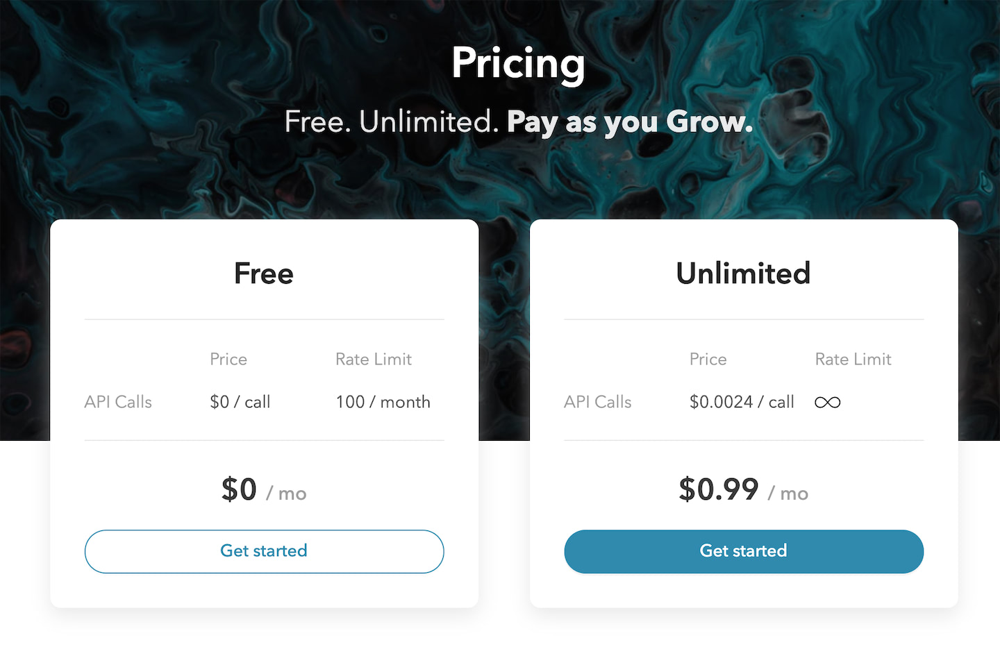
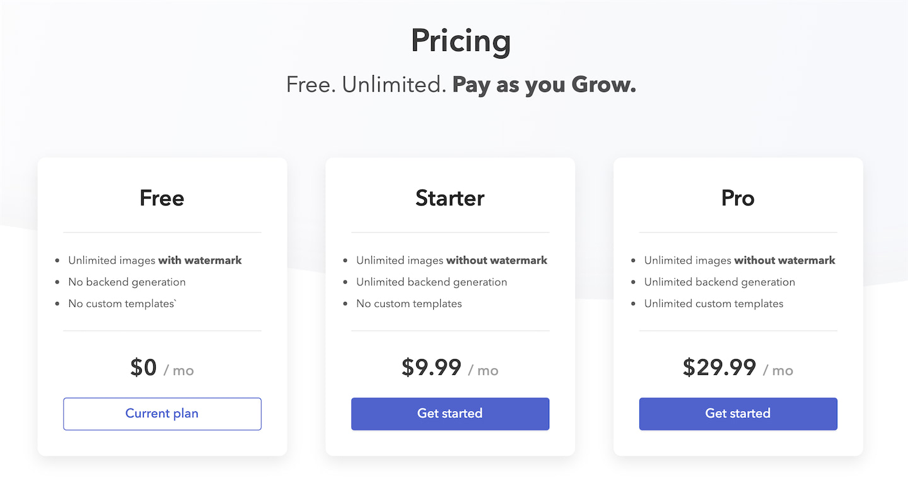

[header](_header.md ':include')

# Pricing

!> All payments and billing info on Saasify are securely handled by [Stripe](https://stripe.com).

Saasify supports most of the billing models that Stripe supports. This includes:

- Automatic recurring subscriptions
- Multiple pricing plans
- Metered and licensed billing
- Billing based on the number of requests in an invoice period (metered billing)
- Per-plan pricing tiers for metered billing
- Per-plan rate limits
- Per-plan service enabling / disabling
- Per-plan service customization (e.g., watermark images on free plan results)
- Support for coupons
- ...

We've found that these features should cover the vast majority of billing models you may want to use.

## Examples

### Default Pricing

The default pricing for new Saasify projects uses two tiers: **Free** and **Unlimited**.

The default free plan is rate-limited and publicly accessible which is important to let users test out your product as easily as possible. The default free plan's public rate limit is to allow 1000 requests every 1 hour.

The default unlimited plan charges a base monthly fee of `$0.99` USD and then tracks the number of API calls via metered billing, charging `$0.0004` per request.

<p align="center">
  
</p>

### Licensed Pricing

Here is an example of three pricing plans using what's known as licensed billing. Here, we charge customers subscribed to a plan a set amount every month regardless of usage.

When a customer subscribes to a plan, they receive a **license** to use your API.

<p align="center">
  
</p>

### Advanced Pricing

Saasify supports many more advanced pricing models, including mixing base licensing fees with metered billing based on usage.

This is what a more advanced pricing setup could look like.

<p align="center">
  
</p>

## Constraints

- Projects must have a minimum of 2 plans and a maximum of 5 plans.
- The first pricing plan must be a publicly accessible free plan.
- All other pricing plans must be paid and require authentication.
- All prices are specified in USD cents.
- Saasify also inherits any constraints required by Stripe.

These constraints were chosen to simplify the most common SaaS use cases, and we believe they're very reasonable, but if you have a use case that conflicts with them, please let us know.

## Schema

Pricing plans are defined by the following TypeScript schema.

```ts
class PricingPlan {
  // display name of this pricing plan
  name: string

  // by default, this is inferred from the plan name
  slug?: string

  // optional display description
  desc?: string

  // whether or not this plan requires authentication
  auth?: boolean

  // UI-only list of features to display for this plan (supports Markdown)
  features?: string[]

  // base amount to charge per month (licensed billing)
  // 99 = $0.99
  // 499 = $4.99
  // 2999 = $29.99
  amount?: number = 0

  // optional metered billing per request
  requests?: PricingPlanMeteredConfig

  // optional rate limit to enforce on this plan
  rateLimit?: RateLimit
}

class PricingPlanMeteredConfig {
  // amount to charge for each request in USD cents (metered billing)
  // 100 = $1.00
  // 2 = $0.02
  // 0.05 = $0.0005
  amount?: number

  // more advanced per-plan tiered pricing options
  billingScheme?: string = 'per_unit' // | tiered
  tiers?: PricingPlanTier[]
  tiersMode?: string = 'graduated' // | volume
}

class PricingPlanTier {
  unitAmount?: number
  flatAmount?: number
  upTo: string
}

class RateLimit {
  // whether or not this rate limit is enabled
  enabled?: boolean = true

  // interval given either in seconds or as a human-readable string
  requestsInterval?: number | string = '1h'

  // maximum number of requests allowed per rate limit interval
  requestsMaxPerInterval?: number = 1000
}
```

Saasify's pricing plan schema should look very familiar if you've used Stripe's subscription billing in the past.

Note that for key names Saasify uses camelCase throughout the platform whereas Stripe uses snake_case. Converting between the two should be straightforward, but please let us know if you have any questions.

## Platform fees

!> Saasify is an early stage startup and we're still figuring out an ideal pricing solution. If you're interested in being an early adopter, we're very open to working with you to figure out a pricing solution that will work for you while still covering our fixed costs. Please don't hesitate to [schedule a call](https://calendly.com/travis-fischer) with us to discuss.

The Saasify platform's default pricing is to take **20%** of all revenue generated from SaaS subscriptions. This is used to pay for Stripe fees, hosting costs, support, and continued product development.

Our [core mission and main objective](./mission.md), however, is to help OSS authors fund their passion via passive income, so during our initial beta period, if you're interested in a different pricing model, feel free to [schedule a call](https://calendly.com/travis-fischer) with us to discuss.

It's important to note that no matter what, Saasify only makes money if you make money, so it's in our best interest to help your SaaS product become successful.

## Maker Payouts

Once your SaaS product starts bringing in revenue, you'll be able to initiate or schedule cashouts via [Stripe Connect](https://stripe.com/connect).

As of January, 2020, we currently don't support an automated way of connecting your Stripe Connect account or initiating a payout, but this feature is on our near-term [roadmap](./roadmap.md). For the time being, we recommend emailing us at [support@saasify.sh](mailto:support@saasify.sh) to work out the details.

<p align="center">
  
</p>
