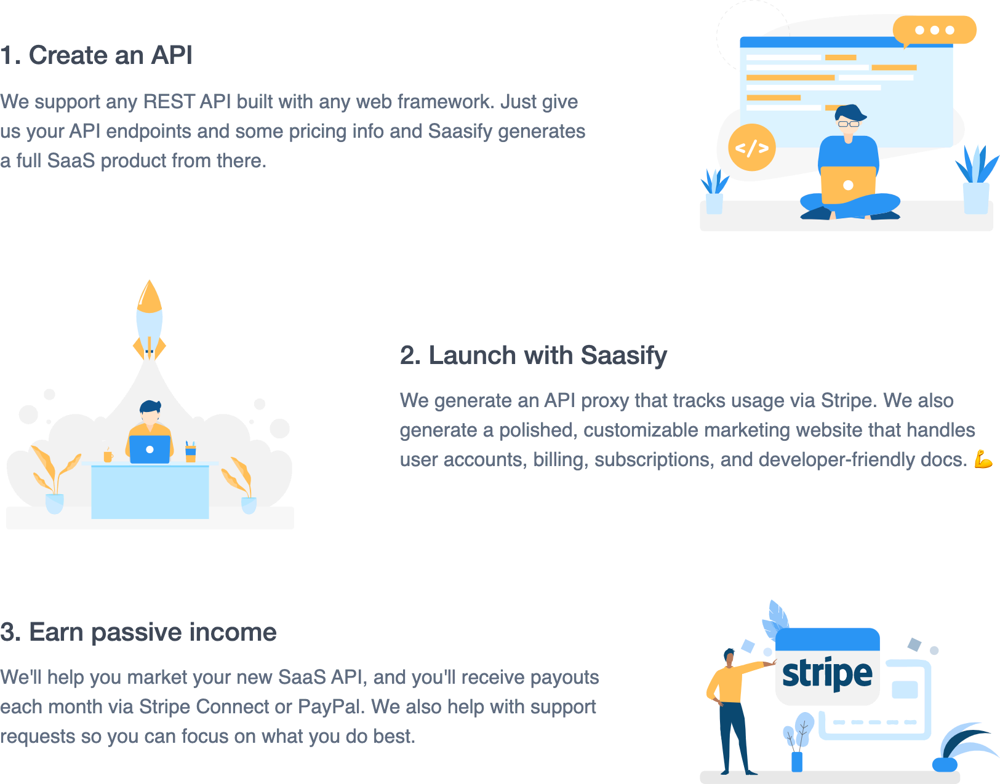

[header](_header.md ':include')

<h3 align="center" style="margin-top: .6rem">
  The easiest way to monetize your API.
</h3>

---

<h3 align="center">
  How it works
</h3>

  

## Getting Started

Visit the [quick start](quick-start.md) guide to get started or check out our list of SaaS [use cases](use-cases.md) and [examples](examples.md) to get inspired.

  

## Why Saasify?

We built Saasify as an ideal solution for makers who want to earn passive income from their side projects.

The only real way to validate a SaaS idea is to ship an MVP and get real customers paying for it. That's why Saasify allows you to quickly ship a quality MVP and start monetizing in minutes instead of months. ✈️

We've helped dozens of SaaS products get off the ground by enabling them to focus only on their unique value instead of SaaS boilerplate. 🔥

  

## Features

- 💰 SaaS is a proven and very profitable business model
- ⚡️️ Quick & easy to setup your own monetizable APIs
- 🔥 Every API comes with its own customizable marketing site
- 💯 Built with JS/TS + AWS Lambda + Stripe
- 🤖 We handle all docs, hosting, billing, and accounts for you
- 🚀 Our CLI makes it really easy to get started

!> Visit the [quick start](quick-start.md) guide to get started or check out our list of SaaS [use cases](use-cases.md) and [examples](examples.md) to get inspired.
