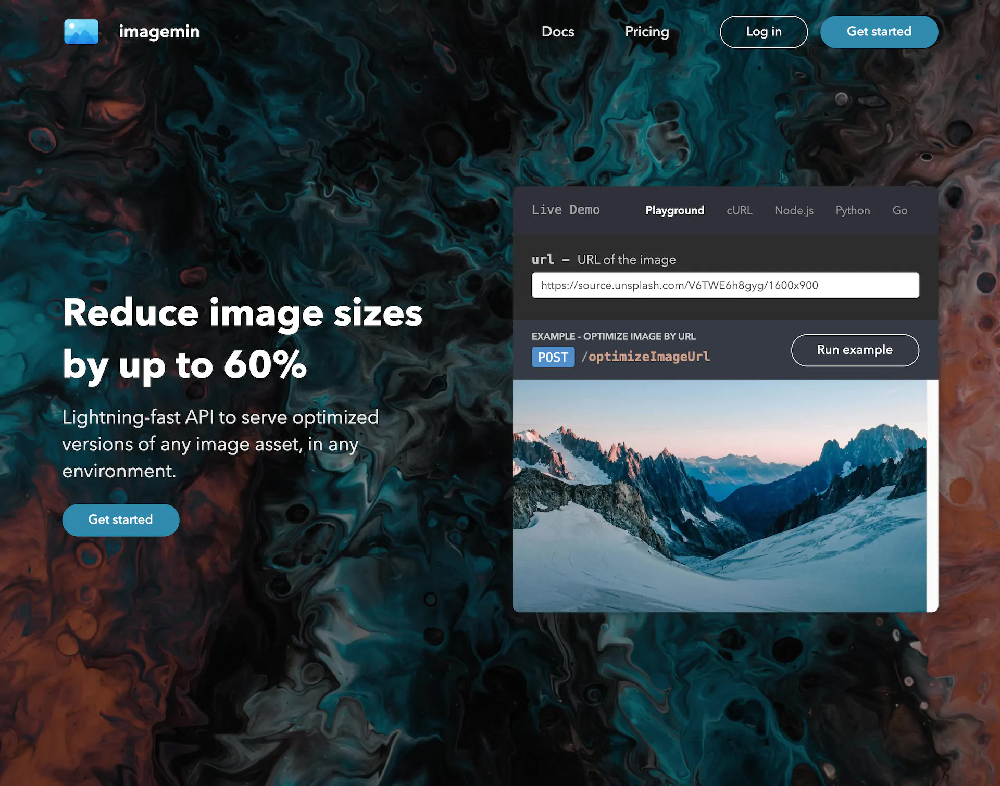

[header](_header.md ':include')

# SaaS Client

Saasify generates a fully functional, standalone SaaS website for your product that your customers can use to sign up, view docs, and manage their recurring billing subscriptions.

Here is a screenshot of an [example](https://imagemin.saasify.sh ':target=_blank') SaaS client's landing page.

  

## Deployments

Each deployment has its own, unique web client which you can access via its `saasUrl` property.

This URL will be available at `https://<username>_<project-name>_<deployment-hash>.saasify.sh`.

For example, [https://transitive-bullshit_puppet-master_b0c5c30c.saasify.sh](https://transitive-bullshit_puppet-master_b0c5c30c.saasify.s ':target=\_blank'h).

Once you publish a deployment for a project, you can view your most recently published deployment by visiting `https://<username>_<project-name>.saasify.sh`.

For example, [https://transitive-bullshit_puppet-master.saasify.sh](https://transitive-bullshit_puppet-master.saasify.s ':target=\_blank'h).

In these examples, the username is `transitive-bullshit`, the project name is `puppet-master`, and the deployment hash is `b0c5c30c`.

## Custom Domains

Once you're ready to launch your SaaS product, you may want to use DNS to alias your generated SaaS web client to a custom domain.

For example, the most recent published deployment for the `puppet-master` project has been aliased to [https://puppet-master.sh](https://puppet-master.sh ':target=_blank').

- Using a custom domain will enhance your product's credibility in the eyes of potential users.
- The underlying API endpoints will still point to `https://ssfy.sh`.
- All SaaS web clients, including ones served from custom domains, will only be available via `https`.

## Customization

You can currently customize basic aspects of your SaaS web client via your `saasify.json` config file.

See [config.saas](./configuration.md#saas) for the list of customizable properties.

To summarize, we currently allow you to customize:

- Product name
- GitHub repo URL
- Homepage hero heading text
- Homepage hero subheading text
- Homepage list of features
- Logo (png or svg)
- Favicon (png or ico)
- Theme name

## Themes

Documentation will be coming soon for:

- The list of built-in themes
- How to customize those themes
  - Ex. overriding colors and injecting custom CSS
- How to create your own themes

  

