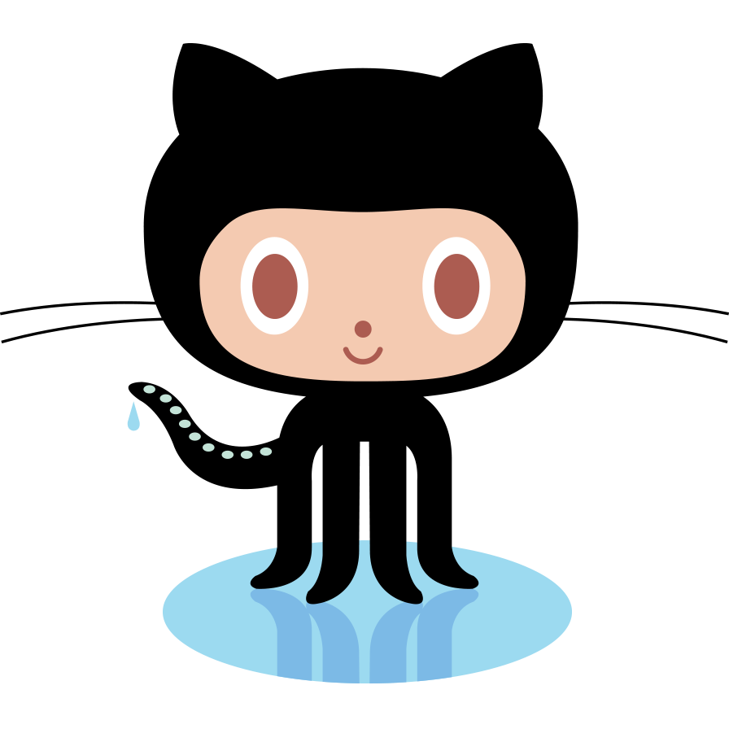
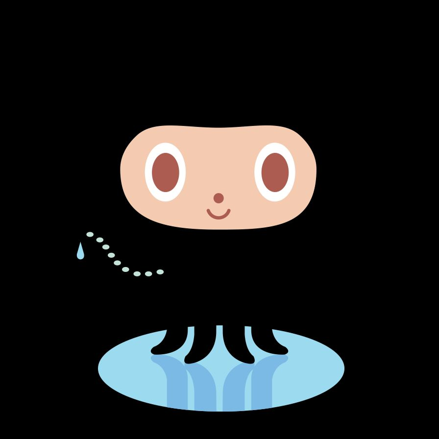
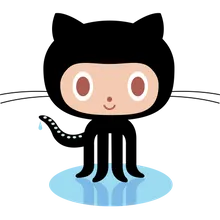
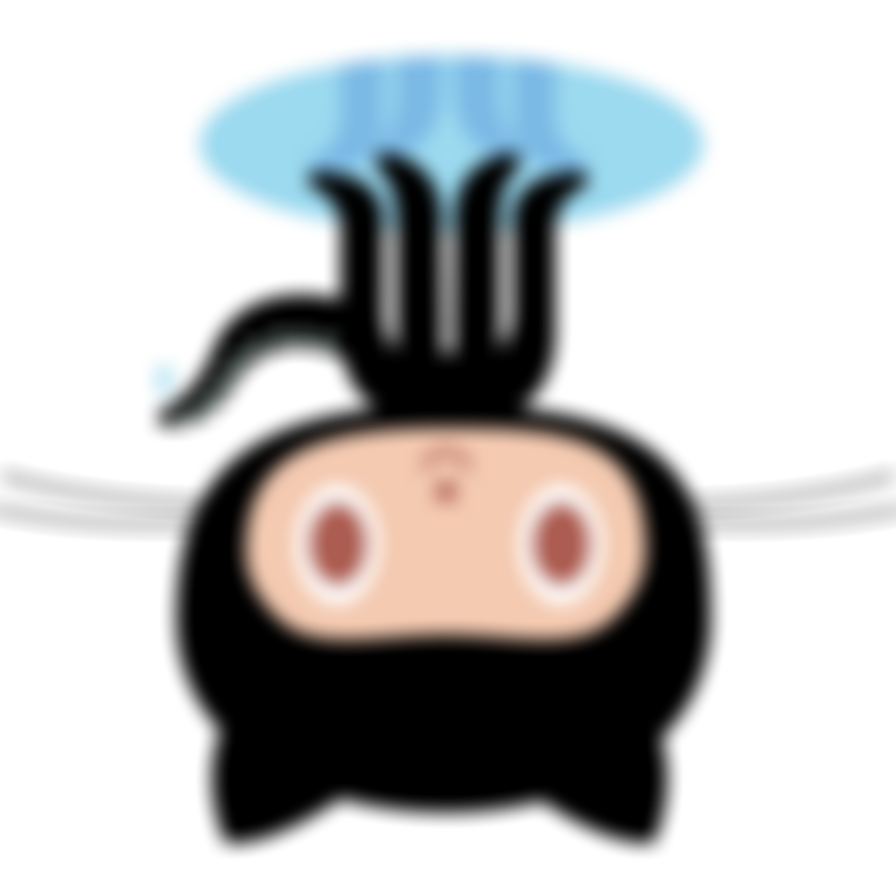

# sharp

> Common library for image manipulation.

This project provides a hosted, SaaS version of [sharp](https://github.com/lovell/sharp) by [Lovell Fuller](https://github.com/lovell).

Note that the majority of the revenue from this hosted API goes back to the open source maintainers behind the original project.

<a href="">
  
</a>

## Examples

The following examples can all be invoked with the following curl template by changing out the `example.json` file:

```
curl -X POST -d '@example.json' 'https://api.saasify.sh/1/call/transitive-bullshit/sharp@2fd6a142' > out.jpeg
```

### Download image

```
curl -X POST -d '@example.json' 'https://api.saasify.sh/1/call/transitive-bullshit/sharp@2fd6a142' > out.png
```

*example.json*
```json
{
  "input": "https://octodex.github.com/images/original.png"
}
```



### Get image metadata

```
curl -X POST -d '@example.json' 'https://api.saasify.sh/1/call/transitive-bullshit/sharp@2fd6a142' > out.json
```

*example.json*
```json
{
  "input": "https://octodex.github.com/images/original.png",
  "ops": [
    {
      "op": "metadata"
    }
  ]
}
```

*output (JSON)*
```json
{
  "format": "png",
  "size": 36582,
  "width": 896,
  "height": 896,
  "space": "srgb",
  "channels": 4,
  "depth": "uchar",
  "density": 72,
  "isProgressive": false,
  "hasProfile": false,
  "hasAlpha": true
}
```

### Convert png to jpeg

```
curl -X POST -d '@example.json' 'https://api.saasify.sh/1/call/transitive-bullshit/sharp@2fd6a142' > out.jpg
```

*example.json*
```json
{
  "input": "https://octodex.github.com/images/original.png",
  "ops": [
    {
      "op": "jpeg"
    }
  ]
}
```

Here's this example as a GET request: [`/?input=https://octodex.github.com/images/original.png&ops[0][op]=jpeg`](https://api.saasify.sh/1/call/transitive-bullshit/sharp@2fd6a142/?input=https://octodex.github.com/images/original.png&ops[0][op]=jpeg).



### Resize and convert to webp

```
curl -X POST -d '@example.json' 'https://api.saasify.sh/1/call/transitive-bullshit/sharp@2fd6a142' > out.webp
```

*example.json*
```
{
  "input": "https://octodex.github.com/images/original.png",
  "ops": [
    {
      "op": "resize",
      "options": {
        "width": 220,
        "height": 128,
        "fit": "contain"
      }
    },
    {
      "op": "webp"
    }
  ]
}
```



### Blur and then flip vertically

```
curl -X POST -d '@example.json' 'https://api.saasify.sh/1/call/transitive-bullshit/sharp@2fd6a142' > out.png
```

*example.json*
```
{
  "input": "https://octodex.github.com/images/original.png",
  "ops": [
    {
      "op": "blur",
      "sigma": 10
    },
    {
      "op": "flip"
    }
  ]
}
```



### Tint, remove alpha, and convert to custom png

```
curl -X POST -d '@example.json' 'https://api.saasify.sh/1/call/transitive-bullshit/sharp@2fd6a142' > out.png
```

*example.json*
```
{
  "input": "https://octodex.github.com/images/original.png",
  "ops": [
    {
      "op": "tint",
      "rgb": "#7743CE"
    },
    {
      "op": "removeAlpha"
    },
    {
      "op": "png",
      "options": {
        "compressionLevel": 7
      }
    }
  ]
}
```


## Status

The following `sharp` operations are supported:

### Input
- [ ] [metadata](https://sharp.pixelplumbing.com/en/stable/api-input/#metadata)
- [ ] [stats](https://sharp.pixelplumbing.com/en/stable/api-input/#stats)
- [ ] ``
- [ ] ``
- [ ] ``
- [ ] ``
- [ ] ``
- [ ] ``
- [ ] ``
- [ ] ``
- [ ] ``
- [ ] ``
- [ ] ``
- [ ] ``
- [ ] ``
- [ ] ``
- [ ] ``
- [ ] ``
- [ ] ``
- [ ] ``
- [ ] ``
- [ ] ``
- [ ] ``
- [ ] ``
- [ ] ``
- [ ] ``
- [ ] ``
- [ ] ``
- [ ] ``
- [ ] ``
- [ ] ``
- [ ] ``
- [ ] ``
- [ ] ``
- [ ] ``
- [ ] ``
- [ ] `tile`
- [ ] `joinChannel`

## License

This SaaS project was bootstrapped with [Saasify](https://saasify.sh).

MIT © [Saasify](https://saasify.sh)
